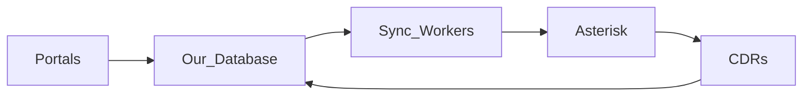
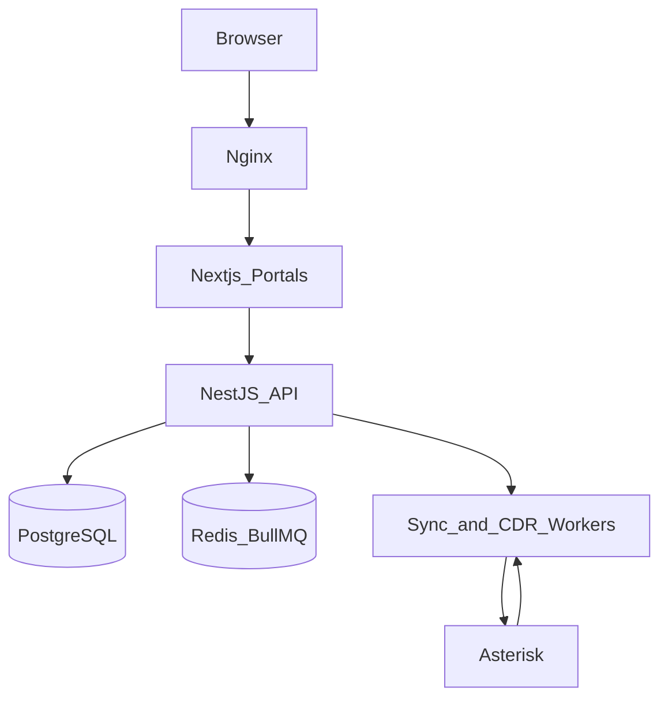

# iSwitch — Product Plan (Living Document)

> Single source of truth for product vision, architecture, and decisions.  
> Update this file as the plan evolves.

**Last updated:** 2026-08-08

---

## Locked decisions (read this first)

These are final unless we explicitly change them in the decision log.

| Topic | Decision |
|-------|----------|
| **Product name** | **iSwitch** (locked — keep despite known name clutter) |
| **Product** | Class 5 platform (SippySoft / MediaCore category) |
| **Traffic** | Retail (hosted PBX) + Wholesale (SIP trunking) on one system |
| **Data model** | **App database is source of truth** → sync to Asterisk as needed |
| **Roles** | Super Admin → Reseller → Retail Customer Admin / Wholesale Customer → End User |
| **Stack** | **TypeScript:** NestJS + Next.js + Prisma + PostgreSQL + Redis/BullMQ + Asterisk |
| **Not using** | Laravel/PHP as primary stack; portals on Asterisk native tables |
| **Hiring** | Hire **Asterisk/telecom** skill when needed — not a PHP team for stack fashion |
| **Current phase** | **2 — Auth & tenancy** (done) · next: Phase 3 Retail |

**Simple mental model:**

1. Portals write to **our database**  
2. Workers **sync** needed config to **Asterisk**  
3. Asterisk handles **calls**  
4. CDRs come **back** to our database for billing and reports  

---

## 1. Vision and positioning

**iSwitch** is a Class 5 softswitch-style platform: hosted PBX for retail customers, SIP trunking for wholesale, multi-role portals, Asterisk as the telephony engine.

We build **both** the application database and the portals. Asterisk is not the business database.

### Brand note
**iSwitch** is the official product name. Name research found clutter (e.g. historical TELES.iSWITCH, Enswitch, VoipSwitch; `iswitch.com` taken; non-VoIP “iSwitch” brands). Accepted knowingly — differentiate with logo, tagline, and domain strategy (e.g. `getiswitch.com` / `iswitch.io` / regional TLD) when going public.

---

## 2. Architecture and data ownership

| Layer | Owns | Does not own |
|-------|------|----------------|
| **App DB** | Tenants, users/roles, DIDs, rates, balances, trunks, PBX features, rated CDRs, billing | Live SIP media |
| **Portals** | All CRUD and ops UI against App DB | Asterisk as primary store |
| **Sync / workers** | Push endpoints, trunks, dialplan/realtime to Asterisk | Business billing rules as source of truth |
| **Asterisk** | Call setup, media, queues, IVR runtime, raw CDRs/events | Customer hierarchy, rates, balances |

- Config: **App DB → Asterisk**  
- Call data: **Asterisk → App DB**

---

## 3. Roles and portal surfaces (v1)

**Super Admin → Reseller → Retail Customer Admin / Wholesale Customer → End User**

| Role | Portal focus |
|------|----------------|
| **Super Admin** | Platform, carriers, global rates, resellers, sync health |
| **Reseller** | Own customers, sub-rates, DIDs, balances, subtree CDRs |
| **Retail Customer Admin** | Extensions, IVR, queues, DIDs, routing, company CDRs |
| **Wholesale Customer** | SIP trunks, capacity, routes, trunk CDRs, balance |
| **End User** | Softphone credentials, voicemail, call history, basic settings |

Access is tenant-scoped.

---

## 4. Feature set — 2026 Class 5 (retail + wholesale)

Priority: **Must** = v1 · **Should** = v1.5 · **Later** = Phase 2+

### 4.1 Shared platform

| Feature | Priority |
|---------|----------|
| Multi-tenant hierarchy | Must |
| Role-based portals | Must |
| Account lifecycle (create, suspend, credit lock, close) | Must |
| DID inventory | Must |
| Upstream carrier trunks | Must |
| Number translation / digit manipulation | Must |
| CDR collection, search, export | Must |
| Prepaid + postpaid balances, credit limits | Must |
| Rate plans / prefixes | Must |
| Real-time call auth (balance, CPS, channels) | Must |
| Fraud controls | Should |
| Taxes / invoices / payments | Later |
| Audit logs + Asterisk sync status | Must |
| White-label branding | Later |
| Public REST API | Should |

### 4.2 Retail (hosted PBX)

| Feature | Priority |
|---------|----------|
| SIP registration, extensions, credentials | Must |
| DID inbound → extension / IVR / queue / ring group | Must |
| Outbound dialing | Must |
| Caller ID | Must |
| Forwarding, DND, follow-me, simultaneous ring | Must |
| Hold, transfer, park, BLF | Should |
| Voicemail + email MWI | Must |
| IVR / auto-attendant | Must |
| Ring groups + basic queues + MoH | Must |
| Conference | Should |
| Time-of-day routing | Should |
| Call recording | Should |
| Seat/package + usage billing | Must |
| Admin + end-user portals, CDRs | Must |
| WebRTC softphone | Should |
| Fax, SMS, mobile app, AI attendant | Later |

### 4.3 Wholesale (SIP trunking)

| Feature | Priority |
|---------|----------|
| Customer trunks (user/pass + IP ACL) | Must |
| Tech prefix / normalization | Must |
| Channels + CPS limits | Must |
| DID termination to customer trunk | Must |
| Outbound via carriers | Must |
| Prefix routing + rates + margins | Must |
| Real-time balance / credit cut-off | Must |
| Codec / header manip, failover, LCR | Should |
| Trunk stats / health | Should |
| Profit routing, MNP/LRN, full SBC, re-rating | Later |

### 4.4 Build order summary

| Priority | Retail | Wholesale |
|----------|--------|-----------|
| **Must (v1)** | Extensions, DIDs, in/out, voicemail, IVR, ring groups, queues, CDRs, self-care | Trunks, CPS/channels, DID-to-trunk, carrier out, rates, balance cut-off, CDRs |
| **Should** | Time routing, recording, conference, WebRTC | LCR/failover, stats, fraud |
| **Later** | Fax, SMS, UCaaS extras | SBC edge, profit routing, re-rating |

---

## 5. Asterisk sync inventory

| App entity | Sync? | Mechanism | Direction |
|------------|-------|-----------|-----------|
| Extension / endpoint | Yes | Realtime PJSIP / ARI | App → Asterisk |
| Wholesale / carrier trunks | Yes | Realtime PJSIP | App → Asterisk |
| DID / dialplan / routes | Yes | Dialplan / realtime | App → Asterisk |
| Queues / IVR / ring groups | Yes | Realtime / conf sync | App → Asterisk |
| Rates, balances, users, roles | No | App DB only (enforce via AGI/ARI hooks) | — |
| CDR | Ingest | CDR / AMI / ARI | Asterisk → App DB |

Portal change → queue sync job → Asterisk → audit log success/fail.

---

## 6. Locked technology stack

### 6.1 What we build with

| Layer | Choice |
|-------|--------|
| Language | **TypeScript** on **Node.js 22 LTS** |
| API | **NestJS** |
| Portals | **Next.js (App Router) + React** |
| UI | **Tailwind CSS** + headless/Radix (shadcn-style) |
| ORM | **Prisma** |
| Database | **PostgreSQL 16+** |
| Cache / jobs | **Redis + BullMQ** |
| Telephony | **Asterisk** (latest LTS) via **ARI + Realtime + AMI** |
| Auth | httpOnly session cookies (preferred) + Nest guards; tenant RBAC |
| Validation | **Zod** (shared package) |
| Repo | **pnpm + Turborepo** — `apps/api`, `apps/web`, `packages/shared` |
| Proxy | **Nginx** |
| Asterisk OS | **Ubuntu 24.04 LTS** |
| Dev | **Docker Compose** (api, web, Postgres, Redis); Asterisk on VM/Docker |

### 6.2 Rules (to avoid confusion)

- **We are not switching to Laravel/PHP.** Research confirmed JS is fine for this product shape.
- Other products (Sippy, FusionPBX) use PHP or mixed stacks — that does **not** change our choice.
- Rating and Asterisk sync run as **workers** (can be replaced later if needed without rewriting portals).
- Money amounts: use decimal-safe types (`decimal.js` or integer micros) — never raw JS floats for balances/rates.
- Asterisk optional realtime DB is only a sync target — **never** the business source of truth.

### 6.3 Hiring guidance

| Hire | Do not hire for |
|------|-----------------|
| Asterisk / PJSIP / dialplan / CDR specialists when voice depth is needed | A full PHP team “because Sippy uses PHP” |
| Optional later: rating specialist if volume demands it | Rewriting the stack mid-project without a hard reason |

### 6.4 Research note (reference only)

Sippy ≈ Python + PHP + Go + Vue. Many billing portals ≈ Laravel. ARI/realtime ≈ Node or Python.  
**Conclusion already applied above:** NestJS + Next.js stays. Details kept only so we do not re-debate this.

---

## 7. Phased roadmap

| Phase | Focus | Outcome |
|-------|--------|---------|
| **0 — Plan** | This document | Vision, features, stack locked |
| **1 — Foundation** | Monorepo (Nest + Next), Prisma schema skeleton, Redis, Asterisk env | Runnable shell |
| **2 — Auth & tenancy** | Roles, tenants, reseller tree, portal shells | Multi-role login |
| **3 — Retail PBX core** | Extensions, DIDs, in/out, voicemail/IVR/queues, sync | First retail calls |
| **4 — Wholesale** | Trunks, CPS/channels, carriers, credit cut-off | First wholesale calls |
| **5 — Billing** | Rates, rating, balances, CDR UI | Chargeable traffic |
| **6 — Hardening** | Audit, retries, fraud basics, monitoring | Production baseline |
| **7 — Differentiating** | WebRTC, LCR polish, recording, SBC edge | Competitive depth |

**Current phase:** 2 — Auth & tenancy.  
**Next:** Phase 3 — Retail PBX core.

---

## 8. Decision log

| Date | Decision |
|------|----------|
| 2026-08-08 | Class 5; retail + wholesale; App DB + portals; sync to Asterisk |
| 2026-08-08 | Roles: Super Admin → Reseller → Retail Admin / Wholesale Customer → End User |
| 2026-08-08 | Feature matrix Must / Should / Later added |
| 2026-08-08 | Early Laravel default dropped after team confirmed JS skills |
| 2026-08-08 | Research vs Sippy/Laravel/ARI: **JS stack confirmed good enough** |
| 2026-08-08 | **LOCKED stack:** NestJS + Next.js + Prisma + PostgreSQL + Redis/BullMQ + Asterisk |
| 2026-08-08 | Plan rewritten for clarity: locked decisions at top; Laravel closed as primary option |
| 2026-08-08 | Name check: iSwitch crowded (TELES.iSWITCH, Enswitch, domains taken) — **still keep iSwitch** as product name |
| 2026-08-08 | **Phase 1 started:** monorepo scaffold (NestJS + Next.js + Prisma + Docker Postgres/Redis) |
| 2026-08-08 | Dev DB: use **local PostgreSQL** (`iswitch` / `postgres`:`postgres`); Redis via Docker or local |
| 2026-08-08 | **Phase 2:** session cookie auth (BFF), RBAC guards, account tenancy tree, role portal shells + seed users |

---

## 9. Open items (still to decide later)

- Full Prisma schema / table list  
- Prepaid vs postpaid priority for first billing release  
- UI visual direction / logo (name is locked as iSwitch)  
- Public domain choice (`.com` taken — evaluate `.io` / `getiswitch.com` / etc.)  
- Reseller sells retail, wholesale, or both by default (assumed: **both**)  
- When to add Kamailio/OpenSIPS (not v1)
